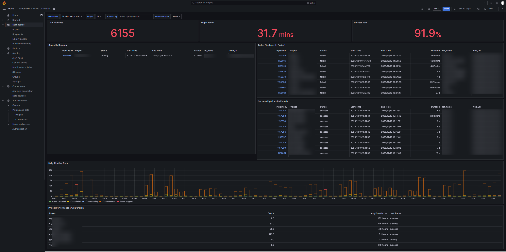

# gitlab-ci-exporter

**[中文文档](README.zh-CN.md)**



`gitlab-ci-exporter` collects GitLab CI pipeline data, persists it in a local SQLite database, and exposes HTTP JSON endpoints for monitoring dashboards and integrations.

## Features

- Persistent pipeline history in `pipelines.db`.
- Incremental monitoring through the GitLab GraphQL API.
- Historical import through the REST API, including a one-shot CLI backfill command.
- Aggregated statistics for Grafana and other HTTP clients.
- Idempotent pipeline upserts keyed by the GitLab pipeline ID.

## Quick start

Prerequisites:

- Rust toolchain for local builds.
- Docker for containerized builds and deployments (optional).

Build and run locally:

```bash
make build
make run
```

The default listener is `0.0.0.0:3000`. See `config.toml` for configuration.

Build and run with Docker:

```bash
make docker-build
make docker-run
```

The Makefile stores the database in the named volume `gitlab-ci-exporter-data` and mounts the local `config.toml` read-only.

## Configuration

The process reads `config.toml` from its current working directory.

- `[server]`: HTTP `host` and `port`.
- `[gitlab]`: GitLab `url`, access `token`, monitored `monitor_groups`, and the optional `branch_filter_regex`.
- `[poller]`: polling interval and startup backfill settings.

Example:

```toml
[server]
host = "0.0.0.0"
port = 3000

[gitlab]
url = "https://gitlab.example.com"
token = "your-gitlab-token"
monitor_groups = ["group/subgroup"]
branch_filter_regex = ".*"

[poller]
interval_seconds = 30
backfill_days = 30
```

Keep the access token out of source control and restrict access to the configuration file.

## Historical backfill

### Startup backfill

On a fresh installation (no stored pipelines), the service imports the last `poller.backfill_days` days before starting the HTTP server. Set this value to a positive number. Username enrichment runs asynchronously after the initial import.

### One-shot CLI backfill

Use the CLI when an existing database needs a historical catch-up or a repeatable manual import:

```bash
# Use poller.backfill_days from config.toml
./target/release/gitlab-ci-exporter backfill

# Import pipelines updated during the last 30 days
./target/release/gitlab-ci-exporter backfill --days 30

# Import pipelines updated after an RFC3339 timestamp
./target/release/gitlab-ci-exporter backfill \
  --from 2026-08-01T00:00:00Z
```

The aliases `--backfill-days` and `--backfill-from` are also supported. The command uses the current working directory for `config.toml` and `pipelines.db`, does not clear the database, upserts repeated pipeline IDs, rebuilds `daily_stats`, and exits after completion.

To inspect all options:

```bash
./target/release/gitlab-ci-exporter --help
```

## API endpoints

- `GET /api/pipelines` — list stored pipelines.
- `GET /api/projects` — list projects present in the database.
- `GET /api/refs` — list stored refs.
- `GET /api/stats/summary` — aggregated count, duration and success rate.
- `GET /api/stats/projects` — per-project statistics.
- `GET /api/stats/trend` — time-series statistics.
- `POST /api/refresh_daily_stats` — rebuild aggregated daily statistics.

Example response from `GET /api/stats/summary`:

```json
{
  "total_count": 1200,
  "avg_duration": 330.7,
  "success_rate": 92.3
}
```

## Grafana

Import `grafana_dashboard.json` in Grafana and configure the `datasource` variable to use an Infinity datasource that can reach the exporter HTTP address.

## Docker deployment

Build the image:

```bash
docker build -t gitlab-ci-exporter:latest .
```

Run it with persistent storage and a custom configuration:

```bash
docker volume create gitlab-ci-exporter-data
docker run -d \
  --name gitlab-ci-exporter \
  --restart unless-stopped \
  -p 3000:3000 \
  -v gitlab-ci-exporter-data:/app \
  -v "$PWD/config.toml:/app/config.toml:ro" \
  gitlab-ci-exporter:latest
```

The runtime image runs as a non-root user and keeps the SQLite database in `/app`.

## systemd deployment

```bash
sudo mkdir -p /var/lib/gitlab-ci-exporter
sudo cp target/release/gitlab-ci-exporter /usr/local/bin/gitlab-ci-exporter
sudo cp config.toml /var/lib/gitlab-ci-exporter/config.toml
sudo useradd --system --no-create-home --shell /usr/sbin/nologin gitlab-ci-exporter || true
sudo chown -R gitlab-ci-exporter:gitlab-ci-exporter /var/lib/gitlab-ci-exporter
sudo tee /etc/systemd/system/gitlab-ci-exporter.service > /dev/null <<'EOF'
[Unit]
Description=GitLab CI Exporter
After=network.target

[Service]
User=gitlab-ci-exporter
Group=gitlab-ci-exporter
WorkingDirectory=/var/lib/gitlab-ci-exporter
ExecStart=/usr/local/bin/gitlab-ci-exporter
Restart=on-failure
Environment=RUST_LOG=info

[Install]
WantedBy=multi-user.target
EOF

sudo systemctl daemon-reload
sudo systemctl enable --now gitlab-ci-exporter
sudo journalctl -u gitlab-ci-exporter -f
```

## Troubleshooting

- If Grafana shows no data, confirm that the datasource can reach `server.host:server.port` and inspect the service logs.
- Check logs with `journalctl -u gitlab-ci-exporter -f` or `docker logs -f gitlab-ci-exporter`.
- Back up `pipelines.db` before maintenance or migrations.

## Development

```bash
make test
make fmt
make clippy
```

Please open an issue or pull request for bugs and improvements.
