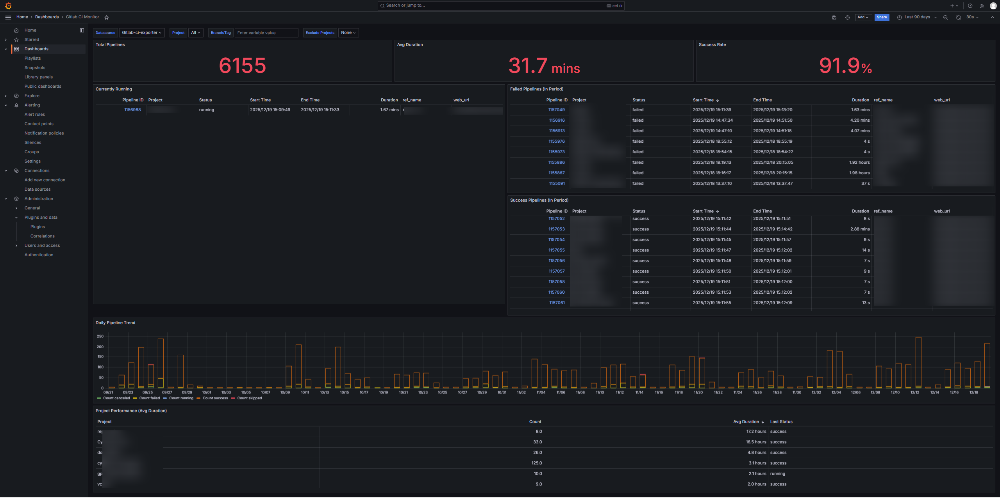

# gitlab-ci-exporter



gitlab-ci-exporter 用于收集 GitLab CI 的 pipeline 指标，持久化到本地 SQLite（`pipelines.db`），并通过 HTTP 接口暴露给监控系统与仪表盘。该文档包含快速上手、配置说明以及历史回填（backfill）功能的使用方法。

**核心特性**
- 轻量 HTTP 导出器，内置持久化（`pipelines.db`）。
- 兼容 Grafana 的 JSON 查询（推荐使用 Infinity datasource）。
- 历史回填：可以从 GitLab 拉取历史 pipeline 并导入本地数据库，保证历史趋势可用。

## 快速开始

先决条件
- 本地构建：Rust 工具链
- 可选：Docker（容器化运行）

构建并运行

```bash
make build
make run
```

默认监听地址：`0.0.0.0:3000`（详见 `config.toml`）。

使用 Docker

```bash
make docker-build
make docker-run
# 或：docker run --rm -p 3000:3000 -v $(pwd)/config.toml:/app/config.toml gitlab-ci-exporter:latest
```

## 功能说明

- 指标与接口：提供 `/api/stats/summary`、`/api/pipelines`、`/api/projects` 等 JSON 接口。
- 持久化：使用 `pipelines.db` 保存 pipeline 记录，支持重启后保留历史数据。
- 历史回填：可配置回填范围与节奏，将 GitLab 的历史 pipeline 导入本地 DB，用于构建完整的历史曲线。

## 历史回填（Backfill）

功能简介
- 回填会根据配置从 GitLab 拉取过往 pipeline 并写入 `pipelines.db`，适用于初次部署或补齐漏采数据。

配置位置
- 在 `config.toml` 的 `[poller]` 部分配置回填选项。

配置项
- `backfill_days`（整数）：启用回填并指定回填天数（例如 `30` 表示回填过去 30 天的数据）。

注意事项
- 只有初次启动时(本地无数据库文件或数据历史为空),才会根据backfill_days的信息去读取历史的gitlab pipeline信息,只有历史信息全部写完后,http服务才会启动,并同时对历史数据中pipeline 的username数据进行补充(该步骤为异步操作，不会阻塞监控服务)

注意事项
- 回填仅在初次启动触发（本地没有数据库文件或历史为空）——程序会根据 `backfill_days` 拉取历史 pipelines 并写入 `pipelines.db`。
- 在初次回填完成并写入历史数据后，HTTP 服务才会启动；历史记录中的额外补充（例如填充 pipeline 的 `username`）可能作为异步任务继续执行，但不会阻塞已启动的监控服务。

## 配置说明

程序会在进程工作目录读取 `config.toml`。主要配置片段：

- `[server]`：`host`、`port`。
- `[gitlab]`：`url`、`token`、`monitor_groups` / `projects` 列表。
- `[poller]`：轮询间隔、回填相关配置。

请参考仓库根目录的 `config.toml` 示例并根据你的环境修改。

## Grafana 仪表盘

仓库包含 `grafana_dashboard.json`，在 Grafana 中导入后，使用 `yesoreyeram-infinity-datasource` 作为数据源。导入后将仪表盘变量 `datasource` 设置为你创建的 Infinity datasource，确保 Grafana 能访问 exporter 的 `server.host:server.port`。

## API 示例

`GET /api/stats/summary`

```json
{
	"total_count": 1200,
	"avg_duration": 330.7,
	"success_rate": 92.3
}
```

`GET /api/pipelines`

```json
[
	{
		"id": 1234,
		"project_name": "org/project-****",
		"ref": "main",
		"status": "success",
		"created_at": "2025-12-18T12:34:56Z",
		"finished_at": "2025-12-18T12:37:30Z",
		"duration": 154
	}
]
```

示例用于仪表盘配置和调试，真实字段可能更多，建议在本地运行后通过接口查看完整结构。

## 部署示例

systemd（示例）

```bash
sudo mkdir -p /var/lib/gitlab-ci-exporter
sudo cp target/release/gitlab-ci-exporter /usr/local/bin/gitlab-ci-exporter
sudo cp config.toml /var/lib/gitlab-ci-exporter/config.toml
sudo useradd --system --no-create-home --shell /usr/sbin/nologin gitlab-ci-exporter || true
sudo chown -R gitlab-ci-exporter:gitlab-ci-exporter /var/lib/gitlab-ci-exporter
sudo tee /etc/systemd/system/gitlab-ci-exporter.service > /dev/null <<'EOF'
[Unit]
Description=GitLab CI Exporter
After=network.target

[Service]
User=gitlab-ci-exporter
Group=gitlab-ci-exporter
WorkingDirectory=/var/lib/gitlab-ci-exporter
ExecStart=/usr/local/bin/gitlab-ci-exporter
Restart=on-failure
Environment=RUST_LOG=info

[Install]
WantedBy=multi-user.target
EOF

sudo systemctl daemon-reload && sudo systemctl enable --now gitlab-ci-exporter && sudo journalctl -u gitlab-ci-exporter -f
```

Docker（示例）

```bash
docker build -t gitlab-ci-exporter:latest .
docker run -d --name gitlab-ci-exporter -p 3000:3000 -v /opt/gitlab-ci-exporter/data:/app --restart unless-stopped gitlab-ci-exporter:latest
```

## 故障排查

- Grafana 无数据：确认 Infinity datasource 能访问 exporter 的地址并检查服务日志。
- 查看日志：`journalctl -u gitlab-ci-exporter -f` 或 `docker logs -f gitlab-ci-exporter`。
- 持久化：`pipelines.db` 保存了所有记录，请定期备份以保留历史数据。

欢迎提交 issue 或 PR 以改进文档或功能。

